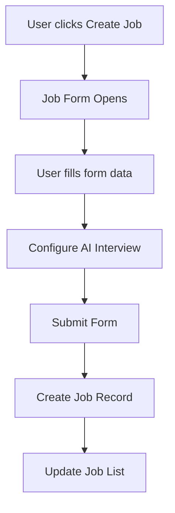
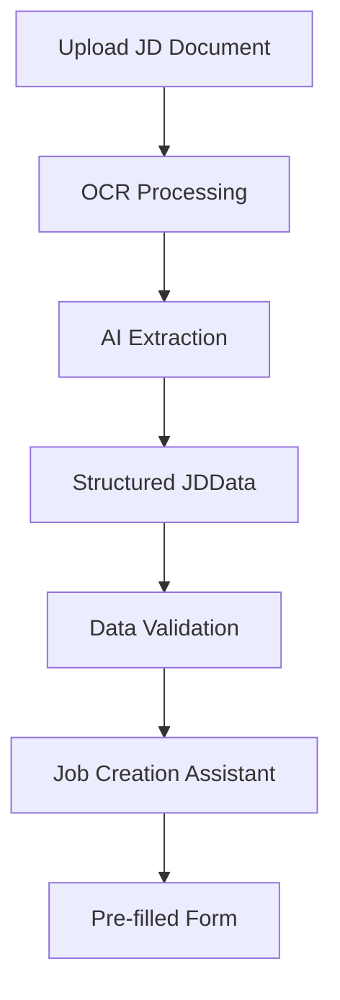
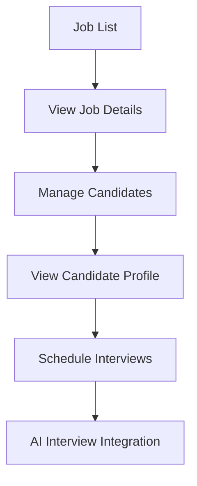

# Job Schema Documentation

This document outlines the comprehensive schema for job management in the Zenkai HR system, including TypeScript interfaces, database structures, and validation rules.

## Overview

The job schema consists of multiple interconnected entities that support:
- Job creation and management
- Candidate tracking
- AI-powered interviews
- Multi-document processing (CV/JD upload)
- Validation and analysis

## Core Types

### 1. Job Interface (Frontend)

Located in: `app/(main)/hr/jobs/_components/job-list.tsx:32`

```typescript
export interface Job {
    id: string;
    title: string;
    department: string;
    location: string;
    type: string;
    status: "active" | "paused" | "closed" | "draft";
    candidates: number;
    interviewsScheduled: number;
    interviewsCompleted: number;
    postedDate: string;
    aiInterviewEnabled: boolean;
}
```

**Purpose**: UI representation for job listings and management
**Key Features**:
- Supports multiple job statuses for workflow management
- Tracks candidate metrics
- Integrates with AI interview system
- Simple, flat structure for optimal UI performance

### 2. Job Description Data (OCR Processing)

Located in: `types/job-description.d.ts:2`

```typescript
export interface JDData {
  jobTitle?: string;
  company?: string;
  location?: string;
  employmentType?: import('./experience').EmploymentType;
  experienceLevel?: import('./experience').ExperienceLevel;
  salary?: SalaryRange;
  remoteOption?: import('./experience').RemoteOption;
  summary?: string;
  aboutCompany?: string;
  responsibilities: string[];
  requirements: JDRequirements;
  skills: import('./skills').SkillsData;
  benefits?: import('./skills').BenefitEntry[];
  applicationDeadline?: Date;
  postedDate?: Date;
  department?: string;
  reportsTo?: string;
  teamSize?: string;
}
```

**Purpose**: Structured data extracted from job description documents via OCR
**Key Features**:
- Comprehensive job description fields
- Structured requirements and skills
- Support for salary ranges and benefits
- Company and team information

## Supporting Types

### Employment Types

Located in: `types/experience.d.ts:28`

```typescript
export type EmploymentType = 
  | 'full-time' 
  | 'part-time' 
  | 'contract' 
  | 'temporary' 
  | 'internship' 
  | 'freelance'
  | 'remote-only'
  | 'hybrid';
```

### Experience Levels

Located in: `types/experience.d.ts:38`

```typescript
export type ExperienceLevel = 
  | 'entry-level' 
  | 'junior' 
  | 'mid-level' 
  | 'senior' 
  | 'lead' 
  | 'manager' 
  | 'director' 
  | 'executive';
```

### Remote Options

Located in: `types/experience.d.ts:48`

```typescript
export type RemoteOption = 
  | 'on-site' 
  | 'remote' 
  | 'hybrid';
```

### Skills Data

Located in: `types/skills.d.ts:2`

```typescript
export interface SkillsData {
  technical?: string[];
  soft?: string[];
  languages?: import('./education').LanguageEntry[];
  tools?: string[];
  frameworks?: string[];
  databases?: string[];
}
```

### Salary Range

Located in: `types/job-description.d.ts:30`

```typescript
export interface SalaryRange {
  min?: number;
  max?: number;
  currency?: string;
  period?: 'hourly' | 'monthly' | 'yearly';
  equity?: boolean;
  bonus?: boolean;
}
```

### Job Requirements

Located in: `types/job-description.d.ts:23`

```typescript
export interface JDRequirements {
  required?: string[];
  preferred?: string[];
  education?: import('./education').EducationRequirement[];
  experience?: import('./education').ExperienceRequirement[];
}
```

## Component Architecture

### Job Container

Located in: `app/(main)/hr/jobs/_components/JobContainer.tsx`

**Purpose**: Main orchestrator for job management UI
**State Management**:
- Current view state (list/details/candidate)
- Selected job and candidate
- Form modes and visibility
- Navigation between different views

**Key Functions**:
- Job creation and editing workflow
- Candidate viewing and management
- Navigation state management

### Job List Component

Located in: `app/(main)/hr/jobs/_components/job-list.tsx`

**Purpose**: Display and manage job listings
**Features**:
- Search and filtering capabilities
- Status and department filters
- Metrics display (candidates, interviews)
- Actions menu for job management
- AI interview status indicators

### Job Form Component

Located in: `app/(main)/hr/jobs/_components/job-form.tsx`

**Purpose**: Create and edit job postings
**Features**:
- Comprehensive job information input
- AI interview configuration
- Custom question management
- Department and status management
- Form validation and submission

## Data Flow

### 1. Job Creation Flow



### 2. Document Processing Flow



### 3. Candidate Management Flow



## Validation Rules

### Database-Level Constraints

#### Job Postings Table

```sql
-- Primary Key Constraints
ALTER TABLE job_postings ADD CONSTRAINT pk_job_postings PRIMARY KEY (id);

-- Foreign Key Constraints
ALTER TABLE job_postings ADD CONSTRAINT fk_job_postings_team 
  FOREIGN KEY (team_id) REFERENCES teams(id) ON DELETE SET NULL;
ALTER TABLE job_postings ADD CONSTRAINT fk_job_postings_creator 
  FOREIGN KEY (created_by_id) REFERENCES users(id) ON DELETE SET NULL;

-- Check Constraints
ALTER TABLE job_postings ADD CONSTRAINT chk_job_postings_title_length 
  CHECK (LENGTH(title) >= 3 AND LENGTH(title) <= 500);
ALTER TABLE job_postings ADD CONSTRAINT chk_job_postings_description_length 
  CHECK (LENGTH(description) >= 10);
ALTER TABLE job_postings ADD CONSTRAINT chk_job_postings_status 
  CHECK (status IN ('draft', 'published', 'archived'));
ALTER TABLE job_postings ADD CONSTRAINT chk_job_postings_created_at 
  CHECK (created_at <= updated_at);

-- Indexes for Performance
CREATE INDEX idx_job_postings_status ON job_postings(status);
CREATE INDEX idx_job_postings_team ON job_postings(team_id);
CREATE INDEX idx_job_postings_created_at ON job_postings(created_at DESC);
```

#### Candidates Table

```sql
-- Primary Key Constraints
ALTER TABLE candidates ADD CONSTRAINT pk_candidates PRIMARY KEY (id);

-- Unique Constraints
ALTER TABLE candidates ADD CONSTRAINT uk_candidates_email UNIQUE (email);

-- Check Constraints
ALTER TABLE candidates ADD CONSTRAINT chk_candidates_name_length 
  CHECK (LENGTH(name) >= 2 AND LENGTH(name) <= 100);
ALTER TABLE candidates ADD CONSTRAINT chk_candidates_email_format 
  CHECK (email ~* '^[A-Za-z0-9._%+-]+@[A-Za-z0-9.-]+\.[A-Za-z]{2,}$');

-- Indexes
CREATE INDEX idx_candidates_email ON candidates(email);
CREATE INDEX idx_candidates_created_at ON candidates(created_at DESC);
```

#### Applications Table

```sql
-- Primary Key Constraints
ALTER TABLE applications ADD CONSTRAINT pk_applications PRIMARY KEY (id);

-- Foreign Key Constraints
ALTER TABLE applications ADD CONSTRAINT fk_applications_job 
  FOREIGN KEY (job_posting_id) REFERENCES job_postings(id) ON DELETE CASCADE;
ALTER TABLE applications ADD CONSTRAINT fk_applications_candidate 
  FOREIGN KEY (candidate_id) REFERENCES candidates(id) ON DELETE CASCADE;

-- Unique Constraints (prevent duplicate applications)
ALTER TABLE applications ADD CONSTRAINT uk_applications_unique 
  UNIQUE (job_posting_id, candidate_id);

-- Check Constraints
ALTER TABLE applications ADD CONSTRAINT chk_applications_status 
  CHECK (status IN ('applied', 'interviewing', 'offered', 'rejected', 'hired'));
ALTER TABLE applications ADD CONSTRAINT chk_interview_score 
  CHECK (interview_score IS NULL OR (interview_score >= 0 AND interview_score <= 100));

-- Indexes
CREATE INDEX idx_applications_status ON applications(status);
CREATE INDEX idx_applications_job ON applications(job_posting_id);
CREATE INDEX idx_applications_candidate ON applications(candidate_id);
CREATE INDEX idx_applications_applied_at ON applications(applied_at DESC);
```

### Application-Level Validation

#### Job Creation Validation

**Required Fields**:
```typescript
const jobCreationSchema = z.object({
  title: z.string().min(3, "Title must be at least 3 characters").max(200, "Title too long"),
  description: z.string().min(10, "Description must be at least 10 characters").max(5000, "Description too long"),
  department: z.enum(["Engineering", "Product", "Design", "Marketing", "Sales", "Operations"], {
    errorMap: () => ({ message: "Please select a valid department" })
  }),
  location: z.string().min(2, "Location required").max(100, "Location too long"),
  type: z.enum(["Full-time", "Part-time", "Contract", "Internship"]),
  status: z.enum(["draft", "active", "paused", "closed"]).default("draft")
});
```

**Optional Fields with Validation**:
```typescript
const optionalJobSchema = z.object({
  requirements: z.string().max(5000, "Requirements too long").optional(),
  salary: z.string().regex(/^\$[\d,]+(-\$\d[\d,]+)?$/, "Invalid salary format").optional(),
  experience: z.enum(["entry", "mid", "senior", "lead"]).optional(),
  aiInterviewEnabled: z.boolean().default(true),
  aiInterviewQuestions: z.array(z.string().min(10).max(200)).max(10, "Too many questions").default([])
});
```

#### AI Interview Configuration Validation

```typescript
const aiInterviewSchema = z.object({
  enabled: z.boolean(),
  questionCount: z.number().min(1).max(20).default(5),
  language: z.enum(["en", "es", "fr", "de"]).default("en"),
  difficulty: z.enum(["basic", "intermediate", "advanced"]).default("intermediate"),
  customQuestions: z.array(z.object({
    question: z.string().min(10).max(500),
    category: z.enum(["technical", "behavioral", "situational"]).optional(),
    weight: z.number().min(0.1).max(1.0).default(1.0)
  })).max(10)
});
```

#### JDData Validation (OCR Processing)

**Strict Validation Rules**:
```typescript
const jdDataStrictSchema = z.object({
  responsibilities: z.array(z.string().min(5)).min(1, "At least one responsibility required"),
  requirements: z.object({
    required: z.array(z.string()).optional(),
    preferred: z.array(z.string()).optional(),
    education: z.array(z.object({
      level: z.enum(['high-school', 'associate', 'bachelor', 'master', 'phd', 'diploma', 'certificate']),
      field: z.string().optional(),
      required: z.boolean().default(false)
    })).optional(),
    experience: z.array(z.object({
      years: z.string().optional(),
      level: z.enum(['entry-level', 'junior', 'mid-level', 'senior', 'lead', 'manager', 'director', 'executive']),
      field: z.string().optional(),
      required: z.boolean().default(false)
    })).optional()
  }),
  skills: z.object({
    technical: z.array(z.string()).optional(),
    soft: z.array(z.string()).optional(),
    tools: z.array(z.string()).optional(),
    frameworks: z.array(z.string()).optional(),
    databases: z.array(z.string()).optional()
  }).refine(
    (data) => (data.technical?.length || 0) + (data.soft?.length || 0) > 0,
    "At least one skill (technical or soft) is required"
  )
});
```

**Flexible Validation for OCR**:
```typescript
const jdDataFlexibleSchema = z.object({
  jobTitle: z.string().optional(),
  company: z.string().optional(),
  location: z.string().optional(),
  employmentType: z.enum(['full-time', 'part-time', 'contract', 'temporary', 'internship', 'freelance', 'remote-only', 'hybrid']).optional(),
  experienceLevel: z.enum(['entry-level', 'junior', 'mid-level', 'senior', 'lead', 'manager', 'director', 'executive']).optional(),
  salary: z.object({
    min: z.number().min(0).optional(),
    max: z.number().min(0).optional(),
    currency: z.string().length(3).optional(),
    period: z.enum(['hourly', 'monthly', 'yearly']).optional(),
    equity: z.boolean().optional(),
    bonus: z.boolean().optional()
  }).optional(),
  responsibilities: z.array(z.string()).default([]),
  requirements: z.object({
    required: z.array(z.string()).default([]),
    preferred: z.array(z.string()).default([]),
    education: z.array(z.any()).default([]),
    experience: z.array(z.any()).default([])
  }).default({}),
  skills: z.object({
    technical: z.array(z.string()).default([]),
    soft: z.array(z.string()).default([]),
    tools: z.array(z.string()).default([]),
    frameworks: z.array(z.string()).default([]),
    databases: z.array(z.string()).default([])
  }).default({})
}).transform((data) => {
  // Normalize and clean data
  return {
    ...data,
    responsibilities: data.responsibilities.filter(r => r.trim().length > 5),
    skills: {
      technical: data.skills.technical?.filter(s => s.trim().length > 1) || [],
      soft: data.skills.soft?.filter(s => s.trim().length > 1) || [],
      tools: data.skills.tools?.filter(s => s.trim().length > 1) || [],
      frameworks: data.skills.frameworks?.filter(s => s.trim().length > 1) || [],
      databases: data.skills.databases?.filter(s => s.trim().length > 1) || []
    }
  };
});
```

### Input Sanitization

#### XSS Prevention

```typescript
import DOMPurify from 'dompurify';

export function sanitizeTextInput(input: string): string {
  return DOMPurify.sanitize(input, {
    ALLOWED_TAGS: [], // No HTML tags allowed
    ALLOWED_ATTR: [],
    KEEP_CONTENT: true
  }).trim();
}

export function sanitizeRichText(input: string): string {
  return DOMPurify.sanitize(input, {
    ALLOWED_TAGS: ['p', 'br', 'strong', 'em', 'ul', 'ol', 'li'],
    ALLOWED_ATTR: [],
    KEEP_CONTENT: true
  });
}
```

#### SQL Injection Prevention

```typescript
// Using Drizzle ORM with parameterized queries
export async function createJobPosting(jobData: NewJobPosting) {
  // Drizzle automatically parameterizes queries
  const [newJob] = await db.insert(jobPostings)
    .values(jobData)
    .returning();
  return newJob;
}

// For raw queries (avoid when possible)
export async function safeRawQuery(searchTerm: string) {
  // Parameterized query
  const result = await db.execute(
    sql`SELECT * FROM job_postings WHERE title ILIKE ${`%${searchTerm}%`}`
  );
  return result;
}
```

### Rate Limiting

```typescript
import { Redis } from 'ioredis';

const redis = new Redis(process.env.REDIS_URL);

export async function checkRateLimit(
  identifier: string, 
  limit: number = 100, 
  window: number = 3600
): Promise<boolean> {
  const key = `rate_limit:${identifier}`;
  const current = await redis.incr(key);
  
  if (current === 1) {
    await redis.expire(key, window);
  }
  
  return current <= limit;
}

// Usage in API routes
export async function POST(request: Request) {
  const ip = request.headers.get('x-forwarded-for') || 'unknown';
  
  if (!(await checkRateLimit(ip, 10, 60))) {
    return new Response('Too Many Requests', { status: 429 });
  }
  
  // Process request...
}
```

### File Upload Validation

```typescript
export function validateFileUpload(file: File): ValidationResult {
  const maxSize = 10 * 1024 * 1024; // 10MB
  const allowedTypes = [
    'application/pdf',
    'application/msword',
    'application/vnd.openxmlformats-officedocument.wordprocessingml.document',
    'image/jpeg',
    'image/png'
  ];
  
  if (file.size > maxSize) {
    return { valid: false, error: 'File size exceeds 10MB limit' };
  }
  
  if (!allowedTypes.includes(file.type)) {
    return { valid: false, error: 'Invalid file type' };
  }
  
  return { valid: true };
}

export async function scanFileForMalware(file: File): Promise<boolean> {
  // Integrate with virus scanning service
  // This is a placeholder for actual malware detection
  return true;
}
```

## Integration Points

### 1. OCR System Integration

- **Extractor Service**: `lib/ocr/extractors.ts`
- **Input**: Raw OCR text
- **Output**: Structured `JDData` with confidence score
- **Features**: JSON-only responses, markdown handling

### 2. AI Interview System

- **Configuration**: Job form AI settings
- **Question Management**: Custom and template-based
- **Integration**: Candidate interview scheduling
- **Status Tracking**: Completion and analytics

### 3. Database Schema

Located in: `lib/db/schema.ts:73`

#### Job Postings Table

```typescript
export const jobPostings = pgTable('job_postings', {
  id: serial('id').primaryKey(),
  title: text('title').notNull(),
  description: text('description').notNull(),
  status: text('status', { enum: ['draft', 'published', 'archived'] })
    .default('draft')
    .notNull(),
  isPublic: boolean('is_public').default(false).notNull(),
  interviewConfig: jsonb('interview_config'), // { "questionCount": 5, "language": "en" }
  teamId: integer('team_id').references(() => teams.id),
  createdById: integer('created_by_id').references(() => users.id),
  createdAt: timestamp('created_at').defaultNow().notNull(),
  updatedAt: timestamp('updated_at').defaultNow().notNull(),
});
```

**Database Type**: `JobPosting` (line 198)
**Insert Type**: `NewJobPosting` (line 199)

#### Candidates Table

```typescript
export const candidates = pgTable('candidates', {
  id: serial('id').primaryKey(),
  name: text('name').notNull(),
  email: text('email').notNull().unique(),
  cvUrl: text('cv_url'), // Link to stored CV file
  createdAt: timestamp('created_at').defaultNow().notNull(),
});
```

**Database Type**: `Candidate` (line 200)
**Insert Type**: `NewCandidate` (line 201)

#### Applications Table

```typescript
export const applications = pgTable('applications', {
  id: serial('id').primaryKey(),
  jobPostingId: integer('job_posting_id')
    .references(() => jobPostings.id)
    .notNull(),
  candidateId: integer('candidate_id')
    .references(() => candidates.id)
    .notNull(),
  status: text('status', {
    enum: ['applied', 'interviewing', 'offered', 'rejected', 'hired'],
  })
    .default('applied')
    .notNull(),
  interviewScore: integer('interview_score'),
  interviewFeedback: jsonb('interview_feedback'),
  interviewVideoUrl: text('interview_video_url'),
  appliedAt: timestamp('applied_at').defaultNow().notNull(),
});
```

**Database Type**: `Application` (line 202)
**Insert Type**: `NewApplication` (line 203)

#### Database Relations

```typescript
export const jobPostingsRelations = relations(jobPostings, ({ one, many }) => ({
  team: one(teams, {
    fields: [jobPostings.teamId],
    references: [teams.id],
  }),
  createdBy: one(users, {
    fields: [jobPostings.createdById],
    references: [users.id],
  }),
  applications: many(applications),
}));

export const applicationsRelations = relations(applications, ({ one }) => ({
  jobPosting: one(jobPostings, {
    fields: [applications.jobPostingId],
    references: [jobPostings.id],
  }),
  candidate: one(candidates, {
    fields: [applications.candidateId],
    references: [candidates.id],
  }),
}));
```

### Schema Mappings

#### Frontend ↔ Database Mapping

| Frontend Field | Database Field | Type | Notes |
|---|---|---|---|
| `job.id` | `jobPostings.id` | `serial` | Primary key |
| `job.title` | `jobPostings.title` | `text` | Required |
| `job.department` | *(not in DB)* | - | Frontend only |
| `job.location` | *(not in DB)* | - | Could be added to `jobPostings` |
| `job.type` | *(not in DB)* | - | Employment type |
| `job.status` | `jobPostings.status` | `enum` | Limited set |
| `job.candidates` | *(derived)* | - | Count from applications |
| `job.interviewsScheduled` | *(derived)* | - | Count from applications |
| `job.interviewsCompleted` | *(derived)* | - | Count from applications |
| `job.postedDate` | `jobPostings.createdAt` | `timestamp` | Auto-generated |
| `job.aiInterviewEnabled` | `jobPostings.interviewConfig` | `jsonb` | Config object |

#### JDData ↔ Enhanced Database Schema

The current database schema is minimal and needs enhancement to fully support `JDData`. Proposed additions:

```typescript
export const jobPostings = pgTable('job_postings', {
  // ... existing fields ...
  
  // Enhanced job description fields
  company: text('company'),
  location: text('location'),
  employmentType: text('employment_type', { 
    enum: ['full-time', 'part-time', 'contract', 'temporary', 'internship', 'freelance', 'remote-only', 'hybrid']
  }),
  experienceLevel: text('experience_level', {
    enum: ['entry-level', 'junior', 'mid-level', 'senior', 'lead', 'manager', 'director', 'executive']
  }),
  remoteOption: text('remote_option', {
    enum: ['on-site', 'remote', 'hybrid']
  }),
  
  // Structured data fields
  responsibilities: jsonb('responsibilities'), // string[]
  requirements: jsonb('requirements'), // JDRequirements
  skills: jsonb('skills'), // SkillsData
  benefits: jsonb('benefits'), // BenefitEntry[]
  
  // Additional metadata
  department: text('department'),
  reportsTo: text('reports_to'),
  teamSize: text('team_size'),
  applicationDeadline: timestamp('application_deadline'),
  
  // Salary information
  salaryMin: integer('salary_min'),
  salaryMax: integer('salary_max'),
  salaryCurrency: varchar('salary_currency', { length: 3 }), // ISO 4217
  salaryPeriod: text('salary_period', { 
    enum: ['hourly', 'monthly', 'yearly']
  }),
  hasEquity: boolean('has_equity').default(false),
  hasBonus: boolean('has_bonus').default(false),
});
```

## Performance Considerations

### Frontend Optimization

1. **Lazy Loading**: Large job lists use virtualization
2. **State Management**: Local component state for performance
3. **Data Fetching**: Efficient API calls with proper loading states
4. **Form Validation**: Real-time validation with debouncing

### Data Processing

1. **OCR Processing**: Async processing with progress indicators
2. **AI Extraction**: Confidence-based validation
3. **Error Handling**: Graceful degradation for failed extractions
4. **Caching**: Result caching for repeated processing

## Security Considerations

### Data Privacy

1. **OCR Data**: Temporary storage with automatic cleanup
2. **Personal Information**: Redaction and masking capabilities
3. **Access Control**: Role-based permissions for job data
4. **Audit Logging**: All job modifications tracked

### Input Validation

1. **XSS Prevention**: Proper sanitization of user inputs
2. **SQL Injection**: Parameterized queries for database operations
3. **File Upload**: Type and size validation for documents
4. **Rate Limiting**: API endpoint protection

## Future Enhancements

### Planned Features

1. **Advanced Filtering**: Multi-criteria filtering with saved filters
2. **Job Templates**: Reusable job posting templates
3. **Bulk Operations**: Mass job status updates and candidate actions
4. **Analytics**: Comprehensive job performance analytics
5. **Integration**: ATS and LinkedIn integration
6. **Mobile Support**: Responsive design for mobile devices

### Scalability

1. **Database Optimization**: Indexing strategies for large datasets
2. **CDN Integration**: Asset optimization for global performance
3. **Microservices**: Service separation for better scalability
4. **Background Processing**: Queue-based OCR and AI processing

---

*This document serves as the authoritative reference for job schema implementation in the Zenkai HR system.*