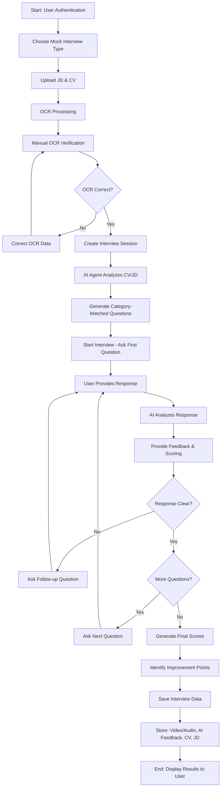
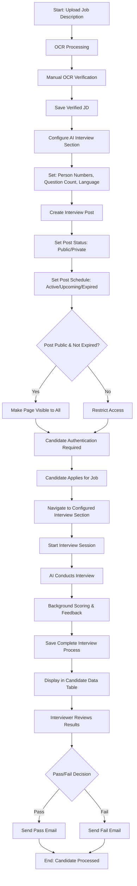

# AI Interview Application

## Overview
AI-powered interview platform for job seekers practice and recruiter candidate evaluation.

## Target Users
### Job Seekers (B2C)
### Recruiters / Hiring Managers (B2B)

## Value Proposition
### Job Seekers: Practice interview to get more confident on real interview
### Recruiters: Fast evaluation, more correct step than manual screening CV

## Feature Extraction

### Job Seeker Features
- User authentication and profile management
- Document upload (CV, Job Description) with OCR processing
- Mock interview creation and configuration
- AI-powered question generation based on CV/JD matching
- Real-time interview session with video/audio recording
- AI feedback and scoring system
- Performance analytics and improvement recommendations
- Interview history and data storage

### HR Team Features
- Job description upload and OCR processing
- Job posting creation and management
- Interview configuration (question count, language, parameters)
- Public/private job posting controls
- Candidate application processing
- Automated interview scheduling and execution
- Background AI scoring and feedback generation
- Candidate database and management dashboard
- Pass/fail decision workflow
- Automated email communications

## Main Use Case Flows

### Job Seeker - Self Practice Interview Flow

### HR Team - Hiring Job Flow

## Technical Requirements
- AI/ML for question generation and response analysis
- OCR for document processing
- Video/Audio recording and storage
- Secure user authentication and data protection

## Success Metrics
- Interview completion rates
- User satisfaction scores
- Time-to-hire reduction for recruiters
- Cost savings vs traditional interviews

## Future Enhancements
- Multi-language support
- ATS integration
- Advanced analytics dashboard
- Industry-specific question banks